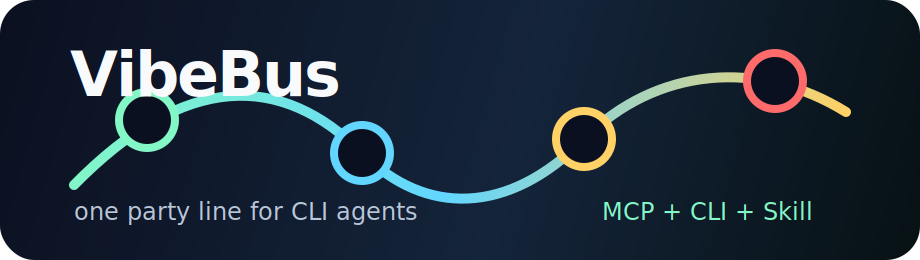
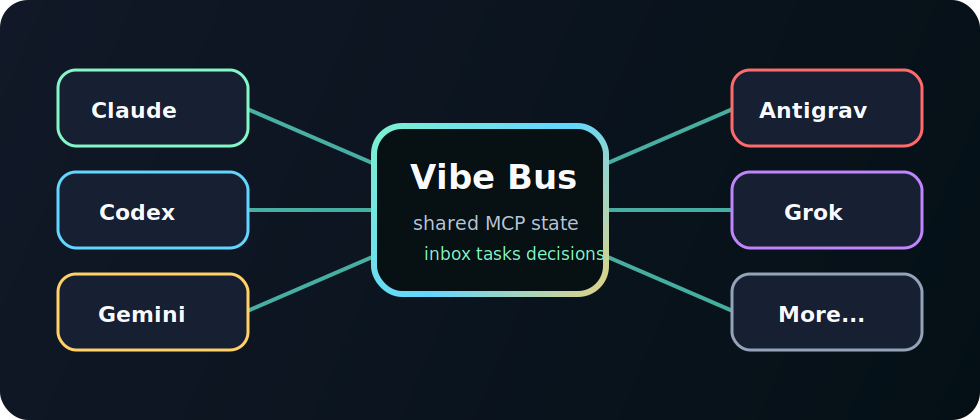
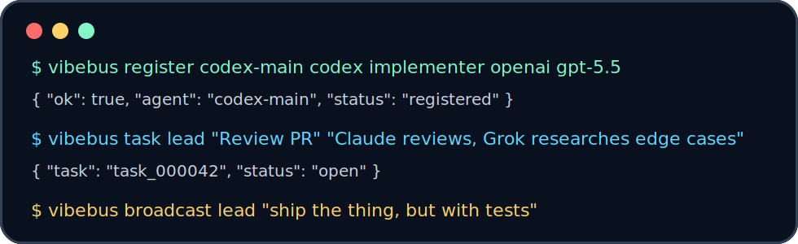

<p align="center">
  
</p>

<p align="center">
  <b>The local MCP party line for CLI agents.</b><br>
  Make Claude, Codex, Gemini, Antigravity, Grok, Cursor, Continue, VS Code, LM Studio, Aider, Goose, and custom agents coordinate without pretending telepathy is a project plan.
</p>

<p align="center">
  =18" src="https://img.shields.io/badge/node-%3E%3D18-83F7C6?style=for-the-badge&labelColor=111827">
  
  
</p>

## What It Is

VibeBus is a local file-backed MCP server, terminal helper, and Codex skill for multi-agent coding work.

Each CLI starts its own stdio MCP server process, but every process shares one state file:

```text
~/.vibebus/state.json
```

That gives your agents a shared:

- Inbox for direct messages and broadcasts.
- Task board for claiming, blocking, and finishing work.
- Decision log for architecture and constraint alignment.
- Status board for who is doing what.
- Client registry for Claude, Codex, Gemini, Antigravity, Grok, and friends.

<p align="center">
  
</p>

## Install

```bash
git clone https://github.com/mightbeanshuu/vibebus.git
cd vibebus
npm link
```

Then verify:

```bash
vibebus clients
vibebus status
```

<p align="center">
  
</p>

## MCP Command

Use this command in any MCP-capable CLI:

```bash
node /Users/mac/vibebus/bin/vibebus-mcp.js
```

If installed with `npm link`, this also works:

```bash
vibebus-mcp
```

## Codex

Add to `~/.codex/config.toml`:

```toml
[mcp_servers.vibebus]
command = "node"
args = ["/Users/mac/vibebus/bin/vibebus-mcp.js"]
```

Restart Codex.

## Claude Code

```bash
claude mcp add vibebus -- node /Users/mac/vibebus/bin/vibebus-mcp.js
```

Restart Claude Code or run:

```bash
claude mcp list
```

## Gemini, Antigravity, Cursor, Continue, LM Studio, OpenClaude

For clients that use `mcpServers` JSON:

```json
{
  "mcpServers": {
    "vibebus": {
      "command": "node",
      "args": ["/Users/mac/vibebus/bin/vibebus-mcp.js"]
    }
  }
}
```

For VS Code-style MCP config:

```json
{
  "servers": {
    "vibebus": {
      "type": "stdio",
      "command": "node",
      "args": ["/Users/mac/vibebus/bin/vibebus-mcp.js"]
    }
  }
}
```

For any other CLI, the rule is the same: add a stdio MCP server named `vibebus` that runs `node /Users/mac/vibebus/bin/vibebus-mcp.js`.

## Tools

VibeBus exposes these MCP tools:

- `known_clients` - list normalized ids for major CLI/IDE agents.
- `register_agent` - identify the current agent, role, provider, model, workspace, and capabilities.
- `heartbeat` - update live status and current task.
- `send_message` - send a direct message to one or more agents.
- `broadcast` - send an instruction/update to every registered agent.
- `read_inbox` - read visible messages, optionally marking them read.
- `create_task` - create shared work.
- `list_tasks` - inspect tasks by status or assignee.
- `claim_task` - claim open or blocked work.
- `update_task` - update status, assignee, files, and notes.
- `record_decision` - store durable team decisions.
- `team_status` - summarize agents, tasks, messages, decisions, and state path.

## Human CLI

```bash
vibebus clients
vibebus register codex-main codex implementer openai gpt-5.5
vibebus register claude-review claude reviewer anthropic sonnet
vibebus broadcast lead "Split work: Codex implements, Claude reviews, Grok researches edge cases."
vibebus task lead "Add tests" "Cover inbox filtering, task claiming, and MCP handshake."
vibebus inbox codex-main
vibebus claim codex-main task_000001
vibebus done codex-main task_000001 "Tests passing."
vibebus status
```

Legacy aliases still work:

```bash
cli-team
cli-team-mcp
```

## Bundled Skill

The repo includes a Codex skill:

```text
skills/vibebus-orchestrator/SKILL.md
```

Install it into Codex:

```bash
mkdir -p ~/.codex/skills
cp -R skills/vibebus-orchestrator ~/.codex/skills/
```

Then ask:

```text
Use $vibebus-orchestrator to coordinate Codex, Claude, Antigravity, Grok, and Gemini on this repo.
```

## Agent Workflow

1. Register at session start with `register_agent`.
2. Read `team_status` and `read_inbox`.
3. Claim a task with `claim_task`.
4. Post progress with `heartbeat`.
5. Send blockers or review asks with `send_message`.
6. Record durable choices with `record_decision`.
7. Mark tasks `done` with `update_task`.

## State

Default:

```text
~/.vibebus/state.json
```

Override:

```bash
VIBEBUS_HOME=/path/to/team-state
VIBEBUS_STATE=/path/to/state.json
```

Compatibility aliases are still supported:

```bash
CLI_TEAM_MCP_HOME=/path/to/team-state
CLI_TEAM_MCP_STATE=/path/to/state.json
```

## Test

```bash
npm run build
npm test
```

Manual MCP smoke test:

```bash
printf '{"jsonrpc":"2.0","id":1,"method":"initialize","params":{"protocolVersion":"2024-11-05"}}\n{"jsonrpc":"2.0","id":2,"method":"tools/list","params":{}}\n' | node bin/vibebus-mcp.js
```

## License

MIT
