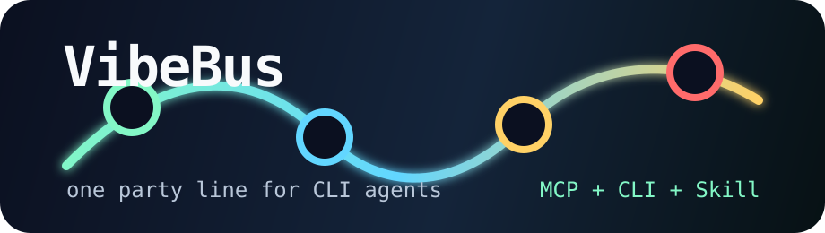
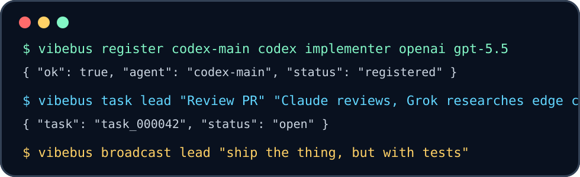

<p align="center">
  
</p>

<p align="center">
  <b>The local MCP party line for CLI agents.</b><br>
  Make Claude, Codex, Gemini, Antigravity, Grok, Cursor, Continue, VS Code, LM Studio, Aider, Goose, and custom agents coordinate without pretending telepathy is a project plan.
</p>

<p align="center">
  <b>v2 is real-time and bidirectional.</b> Agents wake each other, ask each other questions and wait for the answer,
  argue across model vendors, and run shared multi-agent flows — and when nobody answers, you get a typed error instead of silence.
</p>

<p align="center">
  <a href="https://mightbeanshuu.github.io/vibebus/">Landing page</a>
  ·
  <a href="https://github.com/mightbeanshuu/vibebus">GitHub</a>
  ·
  <a href="#install">Install</a>
</p>

<p align="center">
  =18" src="assets/badge-node.svg">
  
  
</p>

## What It Is

Vibe Bus is a local file-backed MCP server, terminal helper, and skill for multi-agent coding work.

Each CLI starts its own stdio MCP server process, but every process shares one state file:

```text
~/.vibebus/state.json
```

That gives your agents a shared:

- Inbox for direct messages, channels, and broadcasts, with threads, read cursors, and required acknowledgements.
- Task board with dependencies that unblock and wake the next agent automatically.
- File leases, so two agents never edit the same paths at once.
- Versioned blackboard for facts the whole team must agree on.
- Decision log, presence board, and a live event journal.

### What changed in v2

**It is real-time.** Every mutation appends to an event journal with a monotonic `seq`, and a tiny sidecar file
lets any process answer "did anything happen?" without reparsing state. Waiting calls park on `fs.watch` instead
of polling — a message sent by another CLI lands in single-digit milliseconds.

**It is bidirectional.** The server no longer only answers questions. It pushes `notifications/resources/updated`
(with `resources/subscribe`), streams activity as `notifications/message`, reports `notifications/progress` during
long waits, and makes outbound requests of its own: `sampling/createMessage` to run another client's model, and
`elicitation/create` to put a prompt in front of that client's human.

**It wakes sleeping agents.** `wake_agent` escalates until something reaches the target:

| Tier | What it does | Works when |
| --- | --- | --- |
| `bus` | Unblocks anything parked in a `wait_*` call | Always |
| `session` | Pushes a log notification to the live MCP session | A process is attached |
| `model` | `sampling/createMessage` runs the target's model, no human needed | Client supports MCP sampling |
| `tmux` | Types the wake into the agent's own pane | Agent runs inside tmux |
| `human` | `elicitation/create` prompts the person | Client supports elicitation |
| `process` | Relaunches the agent headlessly (`claude -p`, `codex exec`, `gemini -p`) | A `wake_command` is registered |

MCP sampling and elicitation support is still uneven across clients in 2026, so the `tmux` and `process` tiers are
what make waking work everywhere. `sleep_agent` parks an agent instead of polling; it returns the instant someone
wakes it, holding the reason and its unread messages.

**It fails loudly.** A coordination bus that looks healthy while delivering nothing is worse than no bus.
`ask_agent` blocks for a real answer and raises `no_reply` with full diagnostics rather than treating silence as
agreement. `ping_agent` proves an agent is alive without spending a model call. Unacknowledged handoffs surface as
dead letters. `vibebus doctor` tells you whether the bus is broken or nobody is home.

**It runs flows.** A flow is a portable multi-agent program written against *roles*, not specific agents, so it
executes on whichever CLIs happen to be alive — waking or relaunching them as needed. There is no scheduler
process: `advance_flow` *is* the scheduler, and it runs inside whichever agent calls it next.

```bash
# Make three different vendors answer the same question and reconcile them.
vibebus ask lead codex-main "..."          # blocking question, hard error if unanswered
```

```jsonc
// A flow: implement, review with a different vendor's model, test, then ask a human.
{ "id": "root", "type": "sequence", "steps": [
  { "id": "implement", "type": "task",  "role": "implementer" },
  { "id": "review",    "type": "task",  "role": "reviewer",
    "exclude_provider": ["${steps.implement.claim.provider}"] },
  { "id": "tests",     "type": "exec",  "input": { "command": "npm test" } },
  { "id": "ship",      "type": "approve", "role": "lead" }
]}
```

`ask_quorum` fans one question across agents on **different model providers** and reports the verdict with an
agreement score — preserving every dissenting answer verbatim rather than averaging disagreement away. It refuses
to call repeated sampling of one vendor a consensus.

## Install

```bash
git clone https://github.com/mightbeanshuu/vibebus.git
cd vibebus
npm link
```

Then verify:

```bash
vibebus clients
vibebus status
```

Prefer raw MCP-shaped data?

```bash
vibebus clients --json
vibebus status --json
```

<p align="center">
  
</p>

## MCP Command

Use this command in any MCP-capable CLI:

```bash
node /Users/mac/vibebus/bin/vibebus-mcp.js
```

If installed with `npm link`, this also works:

```bash
vibebus-mcp
```

## Codex

Add to `~/.codex/config.toml`:

```toml
[mcp_servers.vibebus]
command = "node"
args = ["/Users/mac/vibebus/bin/vibebus-mcp.js"]
```

Restart Codex.

## Claude Code

```bash
claude mcp add vibebus -- node /Users/mac/vibebus/bin/vibebus-mcp.js
```

Restart Claude Code or run:

```bash
claude mcp list
```

## Gemini, Antigravity, Cursor, Continue, LM Studio, OpenClaude

For clients that use `mcpServers` JSON:

```json
{
  "mcpServers": {
    "vibebus": {
      "command": "node",
      "args": ["/Users/mac/vibebus/bin/vibebus-mcp.js"]
    }
  }
}
```

For VS Code-style MCP config:

```json
{
  "servers": {
    "vibebus": {
      "type": "stdio",
      "command": "node",
      "args": ["/Users/mac/vibebus/bin/vibebus-mcp.js"]
    }
  }
}
```

For any other CLI, the rule is the same: add a stdio MCP server named `vibebus` that runs `node /Users/mac/vibebus/bin/vibebus-mcp.js`.

## Tools

**Identity and presence** — `known_clients`, `register_agent`, `heartbeat`, `who`

**Messaging** — `send_message`, `send_to_role`, `broadcast`, `read_inbox`, `wait_for_messages`, `ack_message`, `read_thread`, `channel`

**Real-time** — `tail_events`, `wait_for_events`

**Question and answer** — `ask_agent` (blocks for a real answer, raises `no_reply` otherwise), `reply_to_ask`, `list_asks`, `ping_agent`

**Waking** — `wake_agent`, `sleep_agent`

**Human in the loop** — `request_approval`, `resolve_approval`

**Work** — `create_task`, `handoff_task`, `list_tasks`, `claim_task`, `update_task`, `lease`, `context`, `record_decision`, `team_status`

**Cross-vendor deliberation** — `ask_quorum`, `debate`

**Flows** — `define_flow`, `start_flow`, `advance_flow`, `report_step`, `flow_status`, `cancel_flow`

Resources: `vibebus://status`, `agents`, `tasks`, `messages`, `events`, `leases`, `context`, `decisions`, `guide` —
all subscribable, so subscribed clients are pushed updates as the team moves.

Prompts: `vibebus-start`, `vibebus-handoff`, `vibebus-review`, `vibebus-standby`, `vibebus-second-opinion`.

## Human CLI

```bash
vibebus status                       # team overview
vibebus who                          # who is online, idle, asleep, or gone
vibebus doctor                       # is the bus broken, or is nobody home?
vibebus watch                        # live event stream in your terminal
vibebus serve                        # localhost dashboard at :7717

vibebus register codex-main codex implementer openai gpt-5.5
vibebus ask lead claude-review "Is the migration reversible?"
vibebus ping lead claude-review
vibebus wake lead claude-review "tests are red on main"
vibebus sleep claude-review           # parks until someone wakes it

vibebus lease acquire codex-main src/auth src/api
vibebus ctx set db '{"engine":"sqlite"}'
vibebus handoff lead claude-review "Review README" "Check install docs."
vibebus tail 0
```

Default output is formatted for humans. Add `--json` to any command for the raw payload.

Legacy aliases still work:

```bash
cli-team
cli-team-mcp
```

## Bundled Skill

The repo includes a Codex skill:

```text
skills/vibebus/SKILL.md
```

Install it into Codex:

```bash
mkdir -p ~/.codex/skills
cp -R skills/vibebus ~/.codex/skills/
```

Then ask:

```text
Use $vibebus to coordinate Codex, Claude, Antigravity, Grok, and Gemini on this repo.
```

## Agent Workflow

1. Register at session start with `register_agent`.
2. Read `team_status` and `read_inbox`.
3. Claim a task with `claim_task`.
4. Use `handoff_task` or `send_message` with `requires_ack: true` for important delegation.
5. Use `ack_message` when a handoff is accepted or completed.
6. Use `read_thread` before replying in an active handoff.
7. Post progress with `heartbeat`.
8. Send blockers or review asks with `send_message`.
9. Record durable choices with `record_decision`.
10. Mark tasks `done` with `update_task`.

## Design Notes

The implementation follows the official MCP direction:

- MCP uses JSON-RPC and stdio clients launch local servers as subprocesses, with valid MCP messages only on stdout.
- Tools are model-controlled and should expose clear schemas; Vibe Bus returns both text and `structuredContent`.
- Resources and prompts are first-class MCP server features, so Vibe Bus exposes status/resources and reusable coordination prompts for clients that discover them.
- Claude Code and Gemini CLI both support stdio MCP server configuration; Gemini also discovers tools, resources, and prompts from configured servers.

Primary references:

- https://modelcontextprotocol.io/specification/2025-06-18
- https://modelcontextprotocol.io/specification/2025-06-18/basic/transports
- https://modelcontextprotocol.io/specification/2025-06-18/server/tools
- https://modelcontextprotocol.io/specification/2025-06-18/server/resources
- https://modelcontextprotocol.io/specification/2025-06-18/server/prompts
- https://code.claude.com/docs/en/mcp
- https://github.com/google-gemini/gemini-cli/blob/main/docs/tools/mcp-server.md

## State

Default:

```text
~/.vibebus/state.json      # shared state
~/.vibebus/state.json.seq  # sidecar so watchers can check for changes cheaply
```

Override:

```bash
VIBEBUS_HOME=/path/to/team-state
VIBEBUS_STATE=/path/to/state.json
```

Safety gates, all off by default:

```bash
VIBEBUS_ALLOW_SPAWN=1   # let the process wake tier relaunch an exited agent
VIBEBUS_ALLOW_EXEC=1    # let flows run exec steps
VIBEBUS_TMUX=0          # opt out of tmux keystroke wakes
VIBEBUS_SAMPLING=0      # never run another client's model
```

Retention (all collections are capped so the state file cannot grow forever):

```bash
VIBEBUS_MAX_MESSAGES=800  VIBEBUS_MAX_EVENTS=3000  VIBEBUS_MAX_TASKS=600
```

Compatibility aliases are still supported:

```bash
CLI_TEAM_MCP_HOME=/path/to/team-state
CLI_TEAM_MCP_STATE=/path/to/state.json
```

## Test

```bash
npm run build
npm test
```

Manual MCP smoke test:

```bash
printf '{"jsonrpc":"2.0","id":1,"method":"initialize","params":{"protocolVersion":"2024-11-05"}}\n{"jsonrpc":"2.0","id":2,"method":"tools/list","params":{}}\n' | node bin/vibebus-mcp.js
```

## License

MIT
